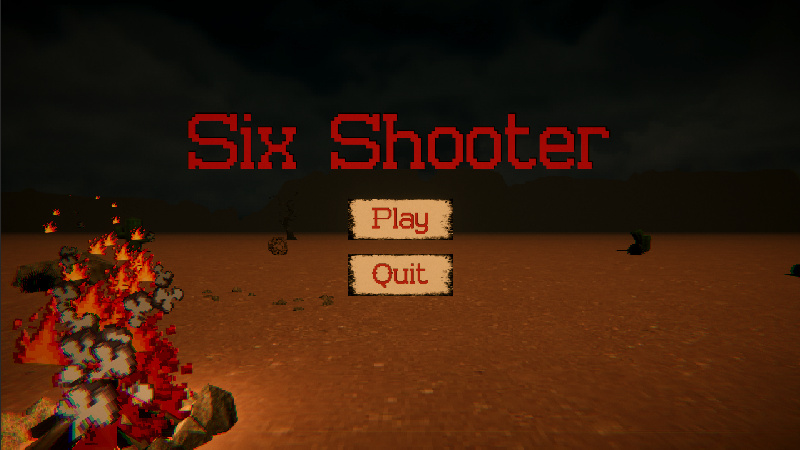
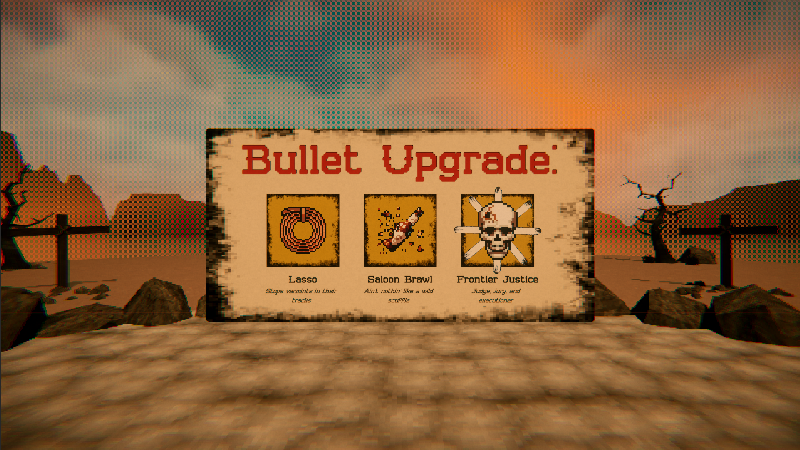
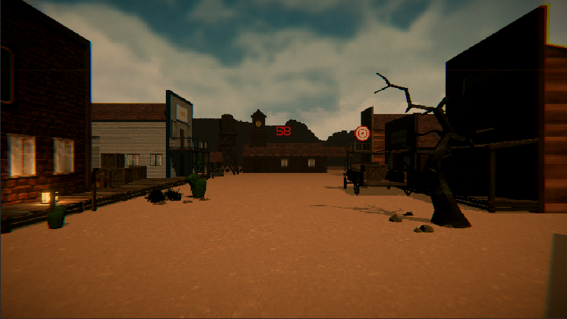
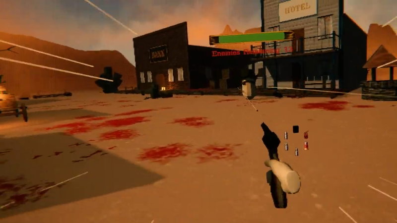
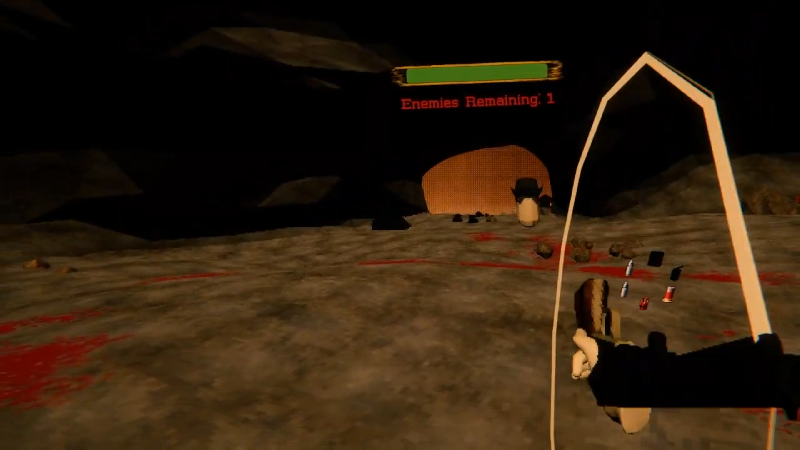
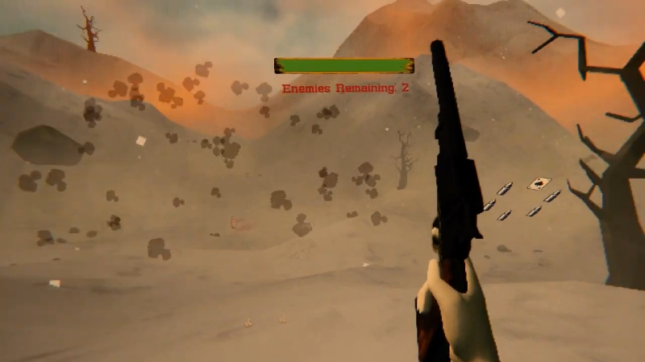
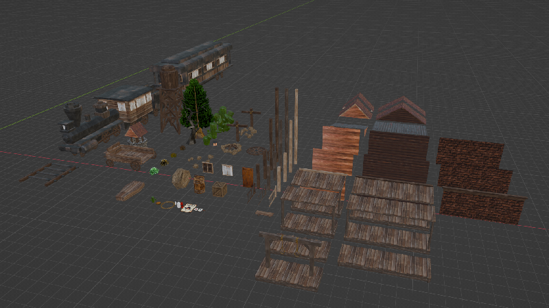
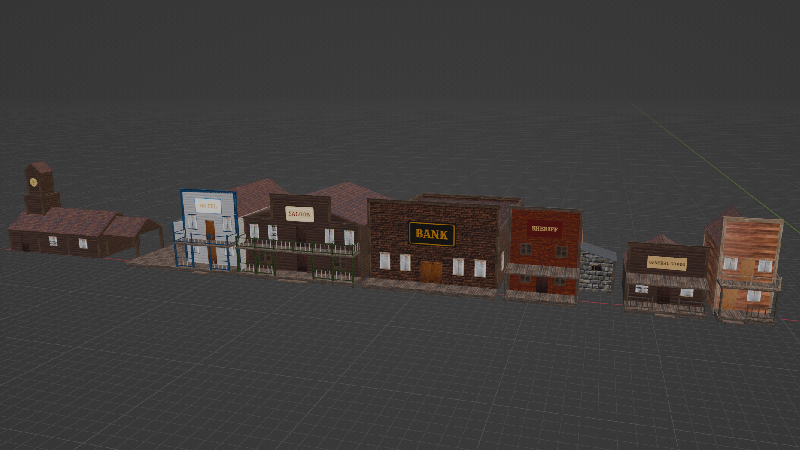

<h1 align="center">
 
Six Shooter
</h1>

<h3 align="center"><a href="https://drive.google.com/file/d/1lOQSlt4yqJvb6CZi5mwI3Ak4Ghn0KnKZ/view?usp=sharing">Demo Video</a></h3>

<h3 align="center"><a href="https://www.boisestate.edu/gimm/">GIMM</a> 250 - Interactive Storytelling </h3>
<h5 align="center"><a href="https://www.boisestate.edu/">Boise State University</a> (Spring 2023) </h5>

<h4 align="center">An old-school, VR roguelike, heavily inspired by Spaghetti Westerns of the mid-to-late 1960s</h4>

  <a href="#project-overview">Project Overview</a> •
  <a href="#project-showcase">Project Showcase</a> •
  <a href="#technical-stack">Technical Stack</a> •
  <a href="#collaborators">Collaborators</a> •
  <a href="#contact">Contact</a>

## Project Overview

Six Shooter is an old-school, VR roguelike, heavily inspired by Spaghetti Westerns of the mid-to-late 1960s.

The game has two modes: a wave-based roguelike, and a target practice. In the roguelike mode, the player has to take on an onslaught of bandits, using only their trusty revolver and a variety of bullet upgrades to survive. In the target practice mode, the player has to shoot targets as quickly and accurately as possible to earn the highest score and accuracy rating.

Using a mix of PS1-style graphics, pixel art particles and icons, and a low-resolution fullscreen shader, the game has a unique and engaging visual style to help separate itself from other VR games.

## Project Showcase

### Gameplay

<h4>Wave-Based Roguelike:</h4>

The main mode of the game, the wave-based roguelike mode is a challenging and engaging way for players to test their skills. As the game is based around the idea of a revolver having only six bullets, each level has 6 waves, with 6 levels in total. At the beginning of each level, the player gets a chance to upgrade one of their bullets, with each bullet having a unique, western-themed ability. The player must use these upgrades, along with smart positioning and quick reflexes, to survive the increasingly difficult waves of bandits.

<h4>Target Practice:</h4>

The first mode created for the game, the target practice mode is a simple, yet engaging way for players to practice their aim and accuracy. Although quite simple, the mode is set in an old-western town to help set the overall tone for the game.

<h4>Additional Quirks:</h4>

Through UX testing, I found that players most enjoyed the reload mechanic, the ability to shoot hats off the bandits' heads, and pressing a button to simply yee-haw. Due to me forcing the player to use all their active bullets before reloading, I chose to add a gun-spinning mechanic for the player to use at any point. This mechanic, similar to the hat shooting and yee-hawing, is purely cosmetic, but is a fun and engaging way to pass the time while waiting for more enemies to arrive while immersing the player in the game's western theme.

<h4>Roguelike:</h4>

<h4>Target Practice:</h4>

### Level Design

<h4>General Layouts:</h4>

Each level has a unique layout, with different obstacles and cover for the player to use. The levels are designed to be challenging, but also fair, with the player having multiple paths and strategies to choose from while defending themselves from the onslaught of bandits.

<h4>Level Variety:</h4>

As the game randomizes the order of levels on each playthrough, it was important to create a variety of levels that each have their own unique look and feel. The levels range from a small town to a cave, mountain, and more. Each level has its own aesthetic and challenges, keeping the game fresh and engaging each time the player plays. At the moment, there are six total levels, with more planned to be added in the future.

### Visuals

Instead of trying to make the game look realistic, I aimed for a PS1-style aesthetic, with low-poly models, a limited color-palette, and a low resolution. This aesthetic helped to give the game a unique look and feel, while also allowing me to create assets quickly and efficiently.

To help further enhance the game's visuals, I used a fullscreen shader that decreases the overall resolution and adds scanlines to the game, giving it a more authentic, retro feel. I also created a variety of pixel art for bullet and upgrade icons, as well as particles for shooting, explosions, and more.

### Sound

Six Shooter has a variety of sound effects and music that help to immerse the player in the game. Each level has its own soundtrack that plays during the playthrough, as well sound effects for shooting, reloading, and more.

In addition to music and sound effects, there are plenty of ambient noises that help to set the tone of the game. From the sound of the wind through the trees to the steam engine of a moving locomotive, the game is filled with sounds that further enhance the game's western theme.

All of the sound effects and music were designed and hand-picked to be fitting for the game's western theme, and to help create a cohesive and engaging experience.

## Technical Stack

 

## Collaborators

<h3>Carson Strout:</h3>

Designer • Programmer • Artist

## Contact

<h3>Carson Strout</h3>

 
 
